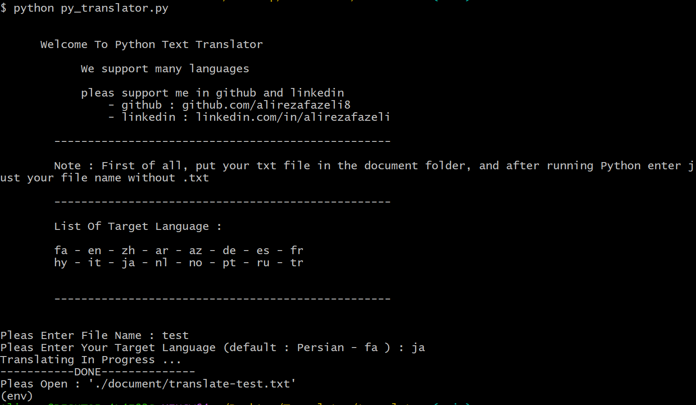

# Python Language Translator

This is a language translator project made by Python.
with this tool, you can translate your .txt files to your target language and get translated text in a new file.

## How to use ?

1. clone the project from the repository
2. install requirement packages
    `pip install -r requirements.txt`
3. put you main .txt file in document folder
4. run the `py_translator.py` file
    `python py_translator.py`

